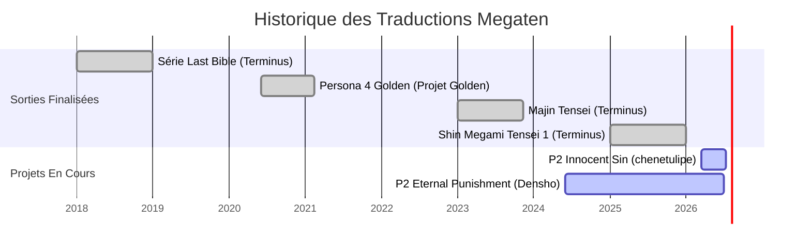

  
# Traductions Françaises Megami Tensei
  
**Répertoire centralisé des patchs amateurs pour la franchise Atlus**

 

> [!NOTE]
> Ce dépôt a pour but de recenser tous les projets de traduction amateur (fan-trad) français concernant les jeux de la licence *Megami Tensei* (Shin Megami Tensei, Persona, Devil Survivor, etc.). 

---

## Chronologie des Projets (Gantt)

Ce graphique illustre la chronologie estimée des différentes sorties de patchs et les projets actuellement en cours de développement.

---

## Liste des Traductions Actives & Terminées

Voici les projets menés à bien ou actuellement en cours de développement.

| Jeu | Plateforme | État | Début | Fin | Équipe / Auteur | Liens & Sources |
|---|---|:---:|:---:|:---:|---|---|
| **Shin Megami Tensei** | PlayStation | ✅ Terminé | - | 31 Déc 2025 | Terminus Traduction | [Terminus Romhack](https://terminus.romhack.net/projects/shinmegamitensei/) |
| **Majin Tensei** | Super Nintendo | ✅ Terminé | - | 11 Nov 2023 | Terminus Traduction | [Terminus Romhack](https://terminus.romhack.net/projects/majintensei/) |
| **Last Bible** | Game Boy Color | ✅ Terminé | - | 1er Avr 2018 | Terminus Traduction | [Terminus Romhack](https://terminus.romhack.net/projects/lastbible/) |
| **Last Bible Special** | Sega Game Gear | ✅ Terminé | - | 17 Nov 2025 | Terminus Traduction | [Terminus Romhack](https://terminus.romhack.net/projects/lastbible/) |
| **Last Bible II** | Game Boy Color | ✅ Terminé | - | 29 Déc 2018 | Terminus Traduction | [Terminus Romhack](https://terminus.romhack.net/projects/lastbible/) |
| **Persona 4 Golden** | PS Vita / PC | ✅ Terminé | Juin 2020 | 14 Fév 2021 | Projet Golden | [TRAF](https://traf.romhack.org/?p=patchs&pid=1334) |
| **Persona 2: Innocent Sin** | PSP | 🚧 En cours | 15 Mars 2026 | 2026 (Bêta) | @chenetulipe & équipe | [GitHub](https://github.com/chenetulipe/P2-FR-IS-PSP) |
| **Persona 2: Eternal Punishment** | PSP | 🚧 En cours | ~ Mi-2024 | - | DenshoTrad | [Annonce X](https://x.com/DenshoTrad/status/2067026649267249462) |
| **Shin Megami Tensei IV** | 3DS | ❓ Inconnu | Oct 2022 | - | Horologium | Bloqué à 60% sans nouvelles. ([Site](https://horologium.neocities.org/) - [X/Twitter](https://x.com/SECHOROLOGIUM)) |

---

## Archives, Tests & Projets Abandonnés

De nombreuses initiatives n'ont malheureusement jamais vu le jour à cause de limitations techniques, de contraintes de temps, ou d'autres facteurs. Cette section rend hommage à ces essais.

| Jeu | Plateforme | État | Début | Fin | Auteur / Équipe | Détails & Historique |
|---|---|:---:|:---:|:---:|---|---|
| **Shin Megami Tensei: Devil Survivor** | NDS | ❌ Abandonné | 2011 | - | MYTH-Project | Projet évoqué vers 2011 sur les forums, mais n'a jamais dépassé le stade d'idée. ([Source](https://myth-project.fr/viewtopic.php?f=11&t=117)) |
| **Persona 4 (Original)** | PS2 | 🎞️ Test technique | - | - | Solistrad | Test de traduction (Proof of Concept) réussi pour la scène d'arrivée à Inaba. Le projet n'a pas été poursuivi. ([Forum](https://romhack.org/viewtopic.php?t=4126) - [Vidéo](https://youtu.be/Wxq20g7pwkE)) |

> [!TIP]
> Si vous souhaitez vous lancer dans le romhacking pour reprendre l'un de ces vieux projets, les documentations et tests techniques listés ci-dessus pourraient être un excellent point de départ !

---

## Clause de Non-Responsabilité

> [!WARNING]
> **Ce répertoire est fourni à titre purement informatif.** 
> Ce dépôt ne contient, n'héberge et ne distribue **aucun fichier de jeu protégé par le droit d'auteur (ROM, ISO, etc.)**. Il se contente de recenser des liens redirigeant vers des correctifs (patchs) créés par des fans, à appliquer sur vos propres copies légales des jeux. L'auteur de ce dépôt n'est pas affilié à Atlus, SEGA ou aux créateurs des traductions répertoriées.

---

## Comment Contribuer au Répertoire ?

Si vous découvrez un projet de traduction non listé ici, ou si un projet passe de "En cours" à "Terminé", votre aide est la bienvenue pour mettre à jour cette page !

1. Ouvrez une **Issue** pour nous le signaler.
2. Ou proposez directement une **Pull Request** en modifiant le fichier `README.md`.

*Dernière mise à jour : 29 Juin 2026*
